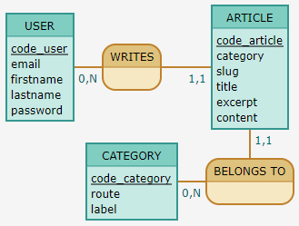
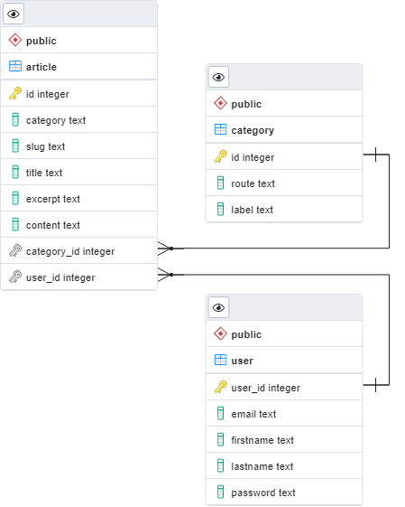

# Conception

## User stories

| As a           | I want to...                                      | So that...                                             |
| -------------- | ------------------------------------------------- | ------------------------------------------------------ |
|                |                                                   |
| Visitor        | be able to signup                                 | I can post articles                                    |
| Visitor        | be able to login                                  | I can post articles                                    |
|                |                                                   |
| Visitor / User | be able to access the site                        | I can browse through the website's content             |
| Visitor / User | be able to access a category                      | I can browse through all the articles of that category |
| Visitor / User | be able to access an article                      | I can visualise the article's content                  |
| Visitor / User | be able to access the 404 page In case of problem | the user can be redirected in case of error            |
|                |                                                   |
| User           | be able to logout                                 | I can secure the access to my account                  |
| User           | be able to create an article                      | I can add a new article to the site                    |
| User           | be able to modify my articles                     | I can update my articles if needed                     |
| User           | be able to delete my articles                     | I can remove my articles from the site                 |

## CDM

_Conceptual Data Model_.

```bash
USER: code_user, email, firstname, lastname, password
WRITES, 11 ARTICLE, 0N USER
ARTICLE: code_article, category, slug, title, excerpt, content

:
CATEGORY: code_category, route, label
BELONGS TO, 11 ARTICLE, 0N CATEGORY
```



## LDM

_Logical Data Model_.

```js
User (CodeUser, Email, Firstname, Lastname, Password)
Category ( CodeCategory, Route, Label )
Article ( CodeArticle, Category, Slug, Title, Excerpt, Content, #CodeUser, #CodeCategory )
BELONGS_TO ( CodeCategory, CodeArticle )
WRITES (CodeUser, CodeArticle)
```

## PDM

_Physical Data Model_.


